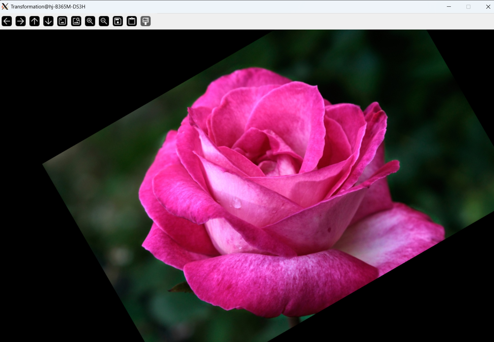
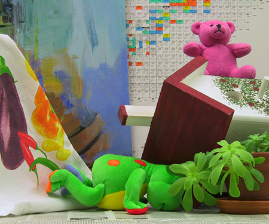
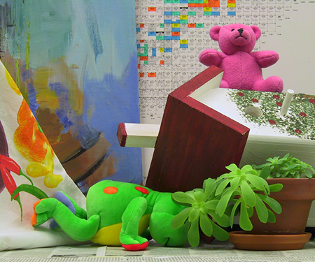

# 과제 요약

## 2-1. 카메라 캘리브레이션 (Camera Calibration)
- **기능**: 체크보드 패턴 이미지를 이용해 카메라의 내부 행렬(K)과 왜곡 계수를 산출함.
- **해결 방법**:
  - `glob`을 사용하여 `images/calibration_images/` 디렉토리의 다수 체크보드 이미지를 불러옵니다.
  - 체크보드의 내부 코너를 (9, 6), 실제 격자 크기를 25.0mm로 설정하고 3D 실제 좌표(objpoints)를 구성합니다.
  - `cv2.findChessboardCorners()`를 사용하여 이미지에서 2D 코너 좌표를 검출하고, `cv2.cornerSubPix()`로 좌표를 정밀하게 조정합니다.
  - `cv2.calibrateCamera()` 함수에 3D 좌표와 정밀화된 2D 좌표를 입력하여 카메라 내부 행렬(K)과 왜곡 계수(dist)를 계산합니다.
  - 계산된 파라미터를 바탕으로 `cv2.undistort()`를 호출하여 렌즈 왜곡이 보정된 결과 영상을 생성합니다.
- **결과 이미지**:
  .png)
  .png)

## 2-2. 이미지 회전 및 변환 (Rotation & Transformation)
- **기능**: 한 장의 이미지에 회전, 크기 조절, 평행 이동을 결합한 기하학적 변환을 수행함.
- **해결 방법**:
  - 원본 이미지(`rose.png`)를 로드하고 중심 좌표를 계산합니다.
    
  - `cv2.getRotationMatrix2D()`를 사용하여 이미지 중심을 기준으로 30도 회전하고 0.8배 축소하는 2x3 어파인 변환 행렬을 생성합니다.
  - 생성된 변환 행렬의 이동 성분(마지막 열)에 x축으로 +80px, y축으로 -40px 만큼 평행 이동하도록 값을 직접 더해줍니다.
  - 최종 완성된 변환 행렬을 `cv2.warpAffine()` 함수에 적용하여 모든 기하학적 변환이 한 번에 반영된 결과 이미지를 출력합니다.
- **결과 이미지**:
  

## 2-3. Stereo Disparity 기반 Depth 추정
- **기능**: 좌우 카메라 이미지의 시차(Disparity) 정보를 활용해 물체까지의 실제 거리(Depth)를 추정함.
- **해결 방법**:
  - 스테레오 이미지(`left.png`, `right.png`)를 그레이스케일로 변환합니다.
    - 왼쪽 원본 이미지: 
    - 오른쪽 원본 이미지: 
  - `cv2.StereoBM_create(numDisparities=64, blockSize=15)`를 사용하여 두 이미지 간의 시차 맵(Disparity Map)을 계산합니다.
  - 초점 거리 $f=700.0$과 베이스라인 $B=0.12$를 이용하여 $Z = \frac{f \times B}{d}$ 공식에 따라 시차를 실제 깊이(Depth) 정보로 변환합니다.
  - 특정 객체(Painting, Frog, Teddy)의 관심 영역(ROI)을 지정하고, 해당 영역 내 유효한(시차가 0보다 큰) 픽셀들의 평균 시차와 평균 깊이를 계산하여 출력합니다.
  - 시차 맵의 시각화를 위해 값을 정규화하고 `cv2.COLORMAP_JET` 컬러맵을 적용하여 저장 및 표시합니다.
- **결과 이미지**:
  .png)
  .png)
  .png)
