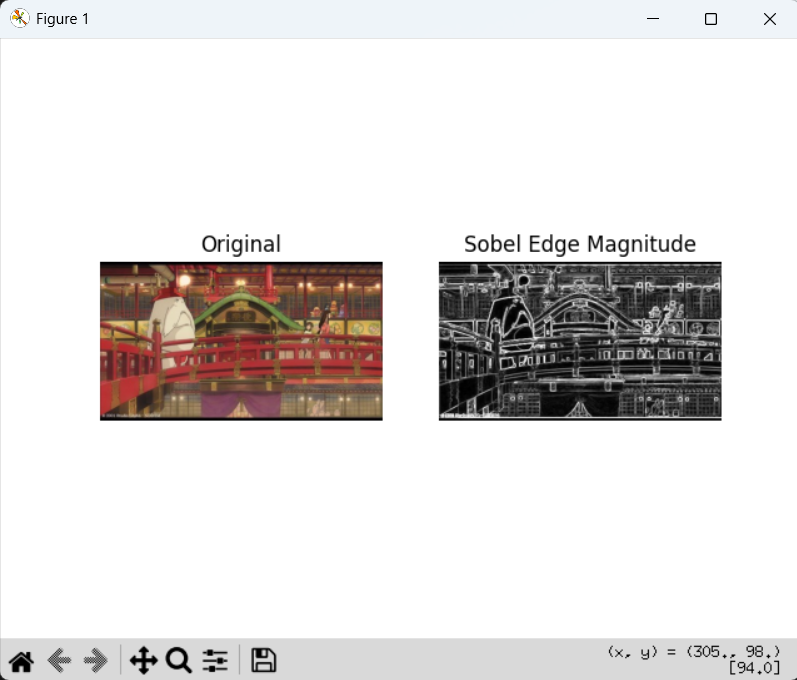
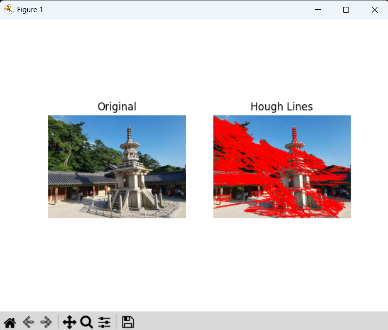
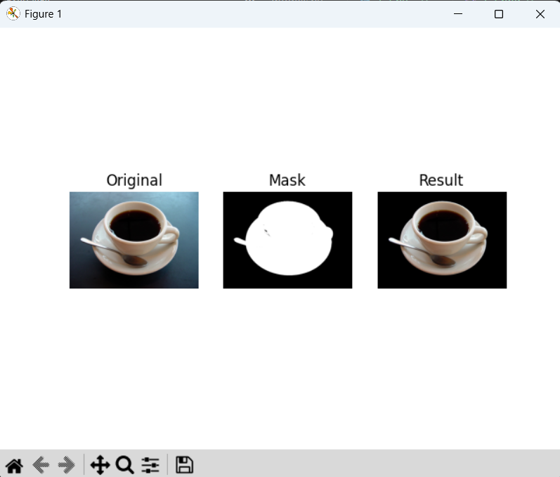

# 과제 요약

## 3-1. 소벨 에지 검출 및 결과 시각화
* **기능**: 그레이스케일 이미지에 소벨(Sobel) 필터를 적용하여 x축과 y축 방향의 에지를 검출하고 강도를 계산하여 시각화함.
* **해결 방법 1**: 원본 이미지(`edgeDetectionImage.jpg`)를 불러와 `cv2.cvtColor()`를 사용해 그레이스케일로 변환합니다.
* **해결 방법 2**: `cv2.Sobel()` 함수를 사용하여 x축(`dx=1, dy=0`)과 y축(`dx=0, dy=1`) 방향의 에지를 각각 검출합니다. 이때 데이터 타입은 `cv2.CV_64F`를 사용하고 커널 크기(`ksize`)는 3으로 설정합니다.
* **해결 방법 3**: `cv2.magnitude()`를 통해 x축과 y축 에지 결과의 벡터 크기(강도)를 계산합니다.
* **해결 방법 4**: 계산된 에지 강도는 `cv2.convertScaleAbs()`를 사용하여 시각화가 가능한 `uint8` 타입으로 변환합니다.
* **해결 방법 5**: Matplotlib의 `subplot`을 활용하여 원본 이미지와 에지 강도 이미지를 나란히 배치하고, 에지 이미지는 `cmap='gray'` 속성을 주어 흑백으로 시각화합니다.
* **결과 이미지**: 

## 3-2. 캐니 에지 및 허프 변환을 이용한 직선 검출
* **기능**: 이미지에서 캐니(Canny) 알고리즘으로 에지 맵을 생성한 후, 허프 변환(Hough Transform)을 통해 직선 성분을 찾아 원본에 표시함.
* **해결 방법 1**: 원본 이미지(`dabo.jpg`)를 로드하고, `cv2.Canny()` 알고리즘을 적용하여 하위 임계값 100과 상위 임계값 200을 기준으로 노이즈가 제거된 얇은 에지 맵을 생성합니다.
* **해결 방법 2**: 생성된 에지 맵을 기반으로 `cv2.HoughLinesP()`를 호출하여 확률적 허프 변환을 수행합니다. 거리 해상도(`rho`), 각도 해상도(`theta`), `threshold`, `minLineLength`, `maxLineGap` 파라터를 조정하여 다보탑 형태에 맞는 유의미한 직선만 필터링합니다.
* **해결 방법 3**: 검출된 직선들의 시작점과 끝점 좌표를 반환받아, `cv2.line()`을 사용해 원본 이미지 복사본 위에 빨간색(`(0, 0, 255)`) 굵기 2의 선으로 덧그립니다.
* **해결 방법 4**: Matplotlib를 사용하여 원본 이미지와 직선이 표시된 결과 이미지를 나란히 시각화합니다.
* **결과 이미지**: 

## 3-3. GrabCut을 이용한 대화식 영역 분할 및 객체 추출
* **기능**: 사용자가 지정한 사각형 영역(Bounding Box)을 바탕으로 GrabCut 알고리즘을 수행하여 배경을 제거하고 전경(객체)만 분리함.
* **해결 방법 1**: 원본 이미지(`coffee cup.JPG`)를 로드하고, 원본과 동일한 크기의 `uint8` 마스크 행렬과 전경/배경 모델(`bgdModel`, `fgdModel`, `np.zeros((1, 65), np.float64)`)을 초기화합니다.
* **해결 방법 2**: 추출하고자 하는 커피 잔 객체가 포함되도록 사각형 영역을 `rect = (x, y, width, height)` 형식으로 설정합니다.
* **해결 방법 3**: `cv2.grabCut()` 함수에 `cv2.GC_INIT_WITH_RECT` 모드를 적용하여 지정한 사각형 영역을 기반으로 반복 최적화를 수행해 대화식 영역 분할을 진행합니다.
* **해결 방법 4**: 연산이 완료된 마스크에서 확실한 배경(`cv2.GC_BGD`)과 아마도 배경일 영역(`cv2.GC_PR_BGD`)은 0으로, 전경 영역은 1로 변환(`np.where()`)하여 이진 마스크를 생성합니다.
* **해결 방법 5**: 원본 이미지에 이진 마스크를 곱하여 배경 픽셀 값을 0(검은색)으로 만든 객체 추출 이미지를 도출합니다.
* **해결 방법 6**: Matplotlib를 사용하여 원본 이미지, 이진 마스크 이미지, 배경이 제거된 최종 결과 이미지 3개를 나란히 시각화합니다.
* **결과 이미지**: 