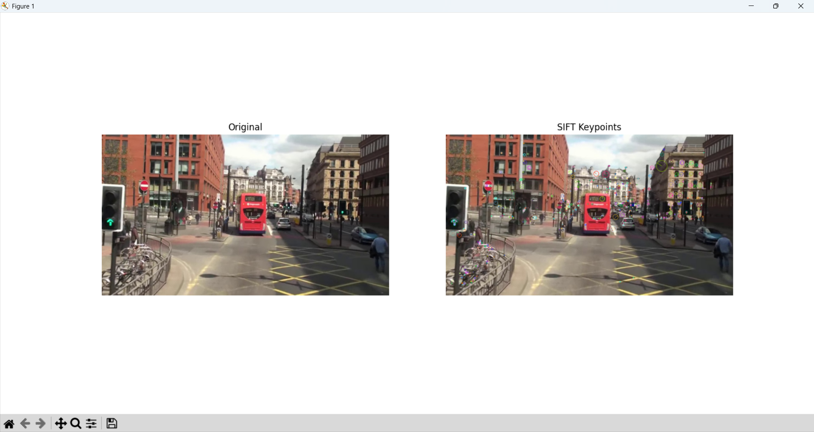
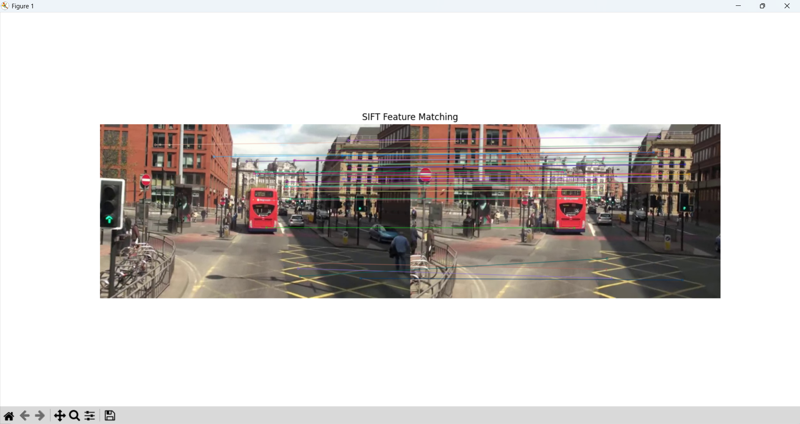

# 과제 요약

## 4-1. SIFT를 이용한 특징점 검출 및 시각화
- **기능**: 이미지에서 크기 변화와 회전에 영향을 받지 않는 강인한 특징점(Keypoint)을 검출하고 이를 시각화함.
- **해결 방법**:
  - `cv2.imread()`를 사용하여 이미지(`mot_color70.jpg`)를 불러온 뒤, 특징 추출을 위해 `cv2.cvtColor()`로 그레이스케일 변환을 수행함.
  - `cv2.SIFT_create(nfeatures=500)`를 통해 특징점의 최대 개수를 500개로 제한하여 연산 효율을 높인 SIFT 객체를 생성함.
  - `detectAndCompute()` 함수를 사용하여 이미지 내 특징점의 위치와 해당 지점의 특성을 나타내는 기술자(Descriptor)를 추출함.
  - `cv2.drawKeypoints()`의 `flags` 인자에 `cv2.DRAW_MATCHES_FLAGS_DRAW_RICH_KEYPOINTS`를 전달하여 각 특징점의 크기와 방향 정보가 시각적으로 나타나도록 함.
- **결과 이미지**:
  

## 4-2. SIFT를 이용한 두 영상 간 특징점 매칭
- **기능**: 서로 다른 두 영상에서 추출된 SIFT 기술자들을 비교하여 대응되는 쌍을 찾고 매칭 결과를 시각화함.
- **해결 방법**:
  - `mot_color70.jpg`와 `mot_color83.jpg`에서 각각 SIFT 특징점과 기술자를 추출함.
  - `cv2.BFMatcher()`를 생성할 때 `cv2.NORM_L2` 거리 계산 방식과 `crossCheck=True` 설정을 적용하여 매칭의 신뢰도를 확보함.
  - `match()` 함수로 두 기술자 간의 유사도를 계산하고, 거리(distance)가 짧은 순서대로 정렬하여 가장 정확한 매칭 쌍을 선별함.
  - `cv2.drawMatches()`를 활용해 상위 50개의 매칭 쌍을 두 이미지 사이에 직선으로 연결하여 출력함.
- **결과 이미지**:
  

## 4-3. 호모그래피를 이용한 이미지 정합 (Image Alignment)
- **기능**: 두 이미지 사이의 투영 관계인 호모그래피(Homography) 행렬을 계산하여 한 이미지를 다른 이미지의 좌표계로 변환해 정합함. 본 과제에서는 제공된 `img1`, `img2`, `img3`의 모든 조합을 테스트하여 최적의 정합 결과를 비교 분석함.
- **해결 방법**:
  - 각 이미지 조합에서 SIFT 특징을 추출하고 `knnMatch(k=2)`를 통해 매칭 후보를 선정함.
  - Lowe's Ratio Test를 적용하여 거리 비율이 0.7 미만인 신뢰도 높은 매칭점만 필터링함.
  - 추출된 대응점들을 `cv2.findHomography()`에 입력하고 `cv2.RANSAC` 알고리즘을 사용하여 잘못된 매칭(Outlier)을 제거한 후 변환 행렬 $H$를 산출함.
  - `cv2.warpPerspective()`를 사용하여 이미지를 뒤틀고, 두 이미지를 통합할 수 있는 크기의 캔버스에 배치하여 파노라마 형태의 결과를 생성함.
- **결과 분석**:
  - 이미지 간의 겹치는 영역(Overlap)과 상대적 위치(좌/우)에 따라 정합의 성공 여부를 확인하기 위해 총 6가지 조합을 모두 실험함.
  - 특히 `img1`과 `img3` 조합에서 안정적인 정합 결과를 얻을 수 있었음.
- **조합별 결과 이미지**:
  | 조합 (Source-Target) | 결과 이미지 |
  |:---:|:---:|
  | **1번 - 2번** | .png) |
  | **1번 - 3번** | .png) |
  | **2번 - 1번** | .png) |
  | **2번 - 3번** | .png) |
  | **3번 - 1번** | .png) |
  | **3번 - 2번** | .png) |