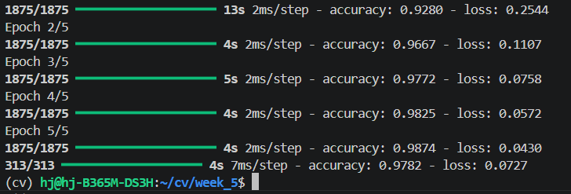
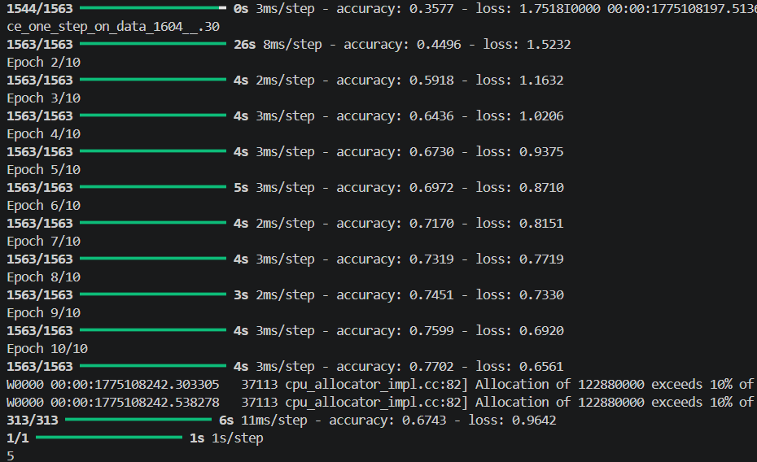

# 과제 요약

## 5-1. 간단한 이미지 분류기 구현
- **기능**: MNIST 데이터셋을 활용하여 손글씨 숫자를 자동으로 분류하는 기본적인 신경망 모델을 구축함.
- **해결 방법**:
  - `tf.keras.datasets.mnist.load_data()`를 통해 데이터를 로드하고, 픽셀 값을 0에서 1 사이로 정규화하여 학습 성능을 향상시킴.
  - `Sequential` 모델을 생성하고 `Flatten` 레이어를 통해 28x28 형태의 2차원 데이터를 1차원 벡터로 변환함.
  - ReLU 활성화 함수를 사용하는 `Dense` 레이어를 은닉층으로 배치하고, 출력층에는 10개의 노드와 Softmax 함수를 적용하여 다중 클래스 분류 구조를 설계함.
  - `adam` 옵티마이저와 `sparse_categorical_crossentropy` 손실 함수를 사용하여 모델을 최적화하고 최종 정확도를 산출함.
- **결과 이미지**:
  

## 5-2. CIFAR-10 데이터셋을 활용한 CNN 모델 구축
- **기능**: 컬러 이미지 데이터셋인 CIFAR-10을 학습시킨 합성곱 신경망(CNN)을 통해 사물을 분류하고, 특정 이미지(dog.jpg)에 대한 예측을 수행함.
- **해결 방법**:
  - `Conv2D`와 `MaxPooling2D` 레이어를 조합하여 이미지의 공간적 특징을 효과적으로 추출하는 CNN 아키텍처를 설계함.
  - 과적합을 방지하고 전역 특징을 추출하기 위해 `Flatten` 이후 완전 연결층(Dense Layer)을 추가하여 모델의 표현력을 높임.
  - 학습이 완료된 모델을 바탕으로 `os.path` 라이브러리를 사용하여 외부 이미지 파일인 `dog.jpg`의 경로를 동적으로 설정함.
  - 이미지를 모델 입력 규격인 32x32 크기로 리사이징하고 정규화를 거친 후 `predict()` 함수를 호출하여 분류 결과를 인덱스 형태로 출력함.
- **결과 이미지**:
  