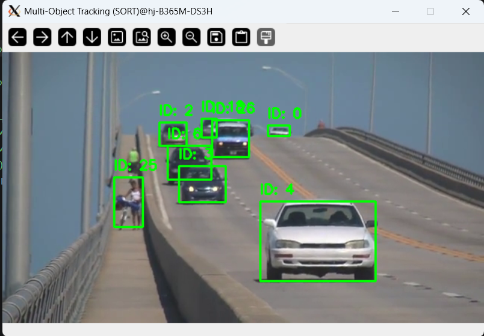

# 과제 요약

## 6-1. YOLOv3와 SORT를 활용한 다중 객체 추적 (MOT)
- **기능**: YOLOv3를 이용해 영상 속 사물을 검출하고, SORT(Simple Online and Realtime Tracking) 알고리즘을 적용하여 각 객체에 고유 ID를 부여하고 추적함.
- **해결 방법**:
  - `cv2.dnn.readNet()`을 통해 YOLOv3의 가중치(`weights`)와 설정(`cfg`) 파일을 로드하여 딥러닝 추론 환경을 구축함.
  - 칼만 필터(Kalman Filter)를 활용한 `KalmanBoxTracker` 클래스를 정의하여 객체의 다음 위치를 예측함.
  - 헝가리안 알고리즘(`linear_sum_assignment`)을 사용하여 이전 프레임의 추적체와 현재 프레임의 검출체 간의 IoU(Intersection over Union)를 최적 매칭함.
  - 검출된 객체 위에 바운딩 박스와 함께 부여된 고유 ID를 `cv2.putText()`로 시각화함.
- **결과 이미지**:
  

## 6-2. MediaPipe Face Mesh를 활용한 얼굴 랜드마크 추출
- **기능**: MediaPipe의 Face Mesh 모델을 사용하여 사람의 얼굴에서 468개의 정밀한 고차원 랜드마크 좌표를 실시간으로 추출함.
- **해결 방법**:
  - **웹캠 대체**: 개발 환경(서버/터미널) 특성상 실시간 웹캠 접근이 제한적인 점을 고려하여, 로컬 영상 파일(`human.mp4`)을 입력 소스로 사용하여 기능을 대체 구현함.
  - `mp.solutions.face_mesh`를 초기화하고 `refine_landmarks=True` 옵션을 설정하여 눈과 입술 주변의 정밀도를 높임.
  - 영상의 재생이 끝나면 `cap.set(cv2.CAP_PROP_POS_FRAMES, 0)`을 통해 자동으로 처음부터 다시 재생되도록 무한 루프를 구성함.
  - 추출된 랜드마크의 정규화 좌표를 영상의 실제 픽셀 크기에 맞게 변환한 뒤, `cv2.circle()`을 사용하여 얼굴 위에 시각화 점을 생성함.
  - `cv2.WINDOW_NORMAL` 설정을 적용하여 고해상도 영상도 모니터 크기에 맞춰 자유롭게 창 크기를 조절할 수 있도록 설계함.
- **결과 이미지**:
  .png)
  .png)